# mcs-ml-assignments
Assignments for the Machine Learning course (COL774) at IITD 

## Assignment 1

**1. Linear Regression using Gradient Descent**

- Leaning Rate(&eta;) = 0.001
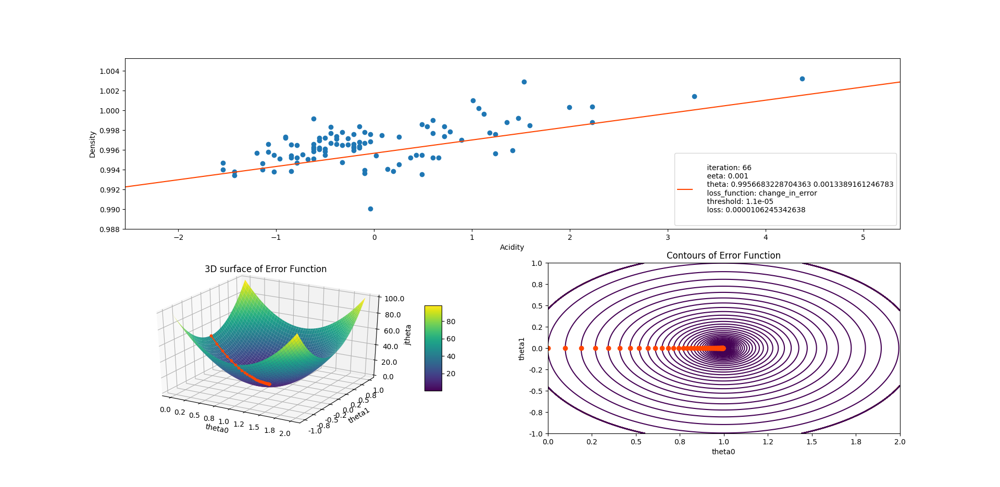

- Leaning Rate(&eta;)= 0.017

**2. Locally weighted Linear Regression using Normal Equations**

- Bandwidth(&tau;) = 0.30

**3. Logistic Regression using Newton's Update Method**

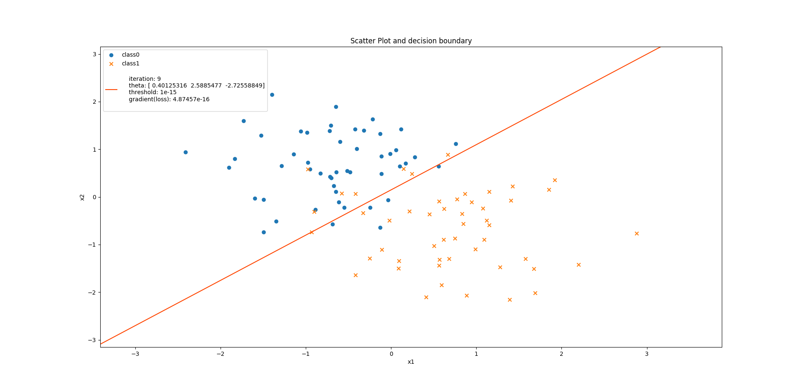

**4. Gaussian Discriminant Analysis**

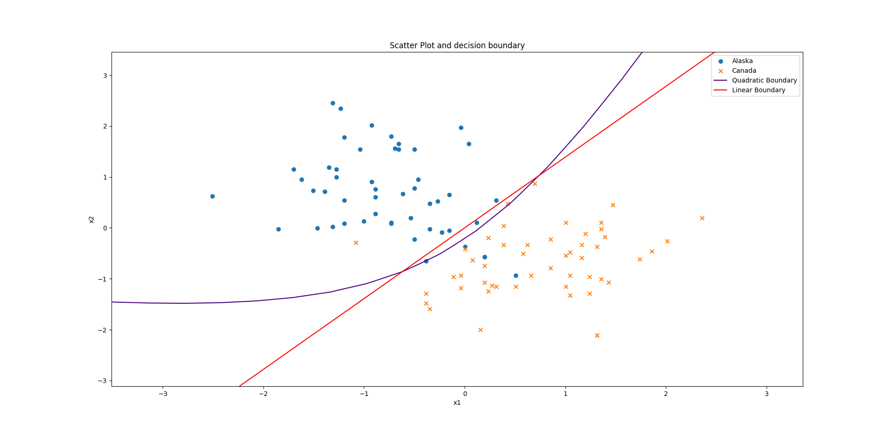

## Assignment 2

**1. Naive Bayes**

- Basic
- +Stemming
- +Stopwords Removal
- +Feature Engineering

**2. SVM**

- MNIST Hand written digit recognition
- Pegasos Algorithm: 92.49% Test accuracy
- LibSVM Linear Kernel: 92.78
- Gaussian Kernel: 97.23

## Assignment 3

### 1. Decision Trees and Random Forests

**a. Decision Trees**

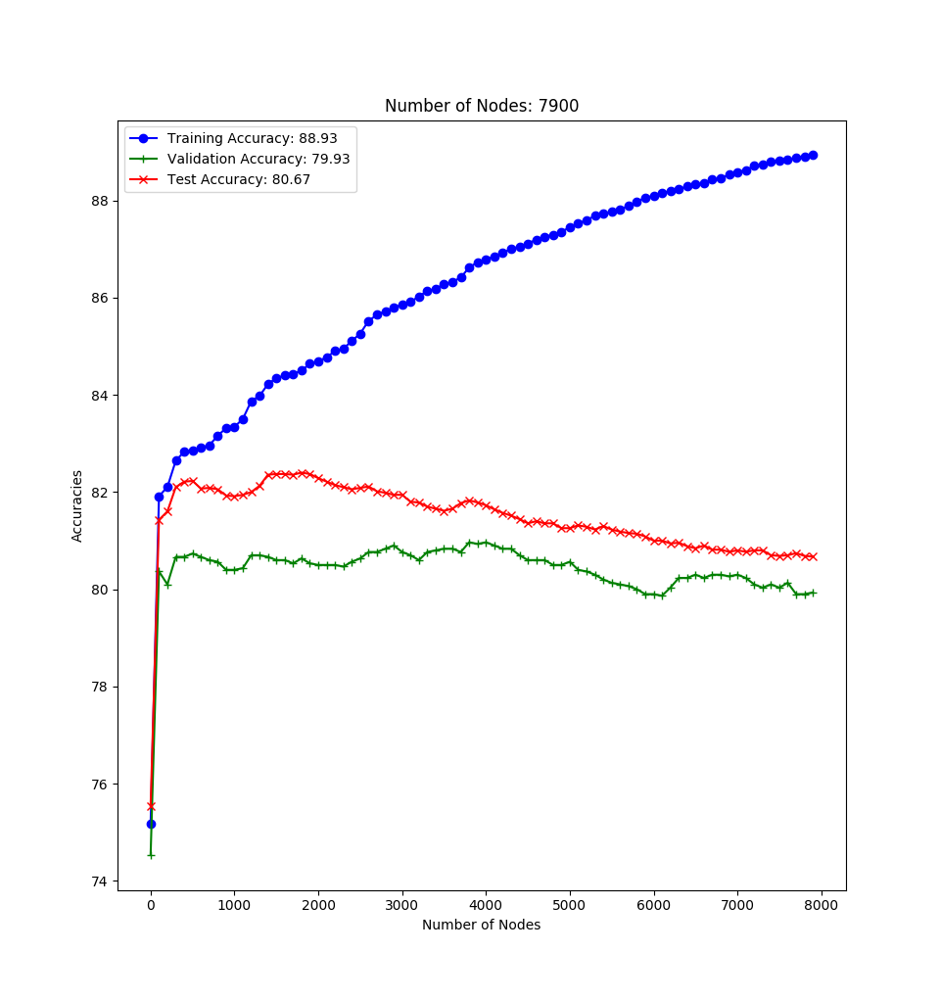

**b. Post Pruning Decision Trees**
- Inefficient Implementation (Takes too much time)

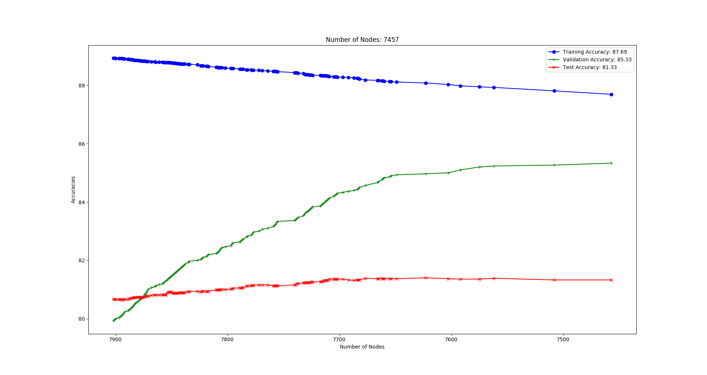

**c. Dynamically calculate median of Numerical Data**

Instead of calculating the median of the numerical data beforehand median at a particular node is calculated dynamically using only the data coming to a particular node.

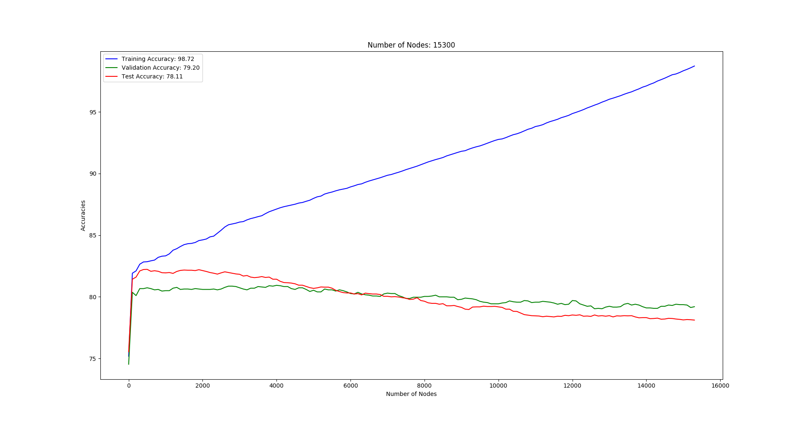

**d. Scikit Learn Decision Tree and Random Forests**

- Dtree Test acc: 84.80%
- Rforest Test acc: 85.485%

### 2. Neural Network

**a. Implement Neural Network Class**

- Forward Pass: to update outputs
- Backward Pass: backpropogation

**b. Visualizing Decision Boundaries**

- Logistic Regression

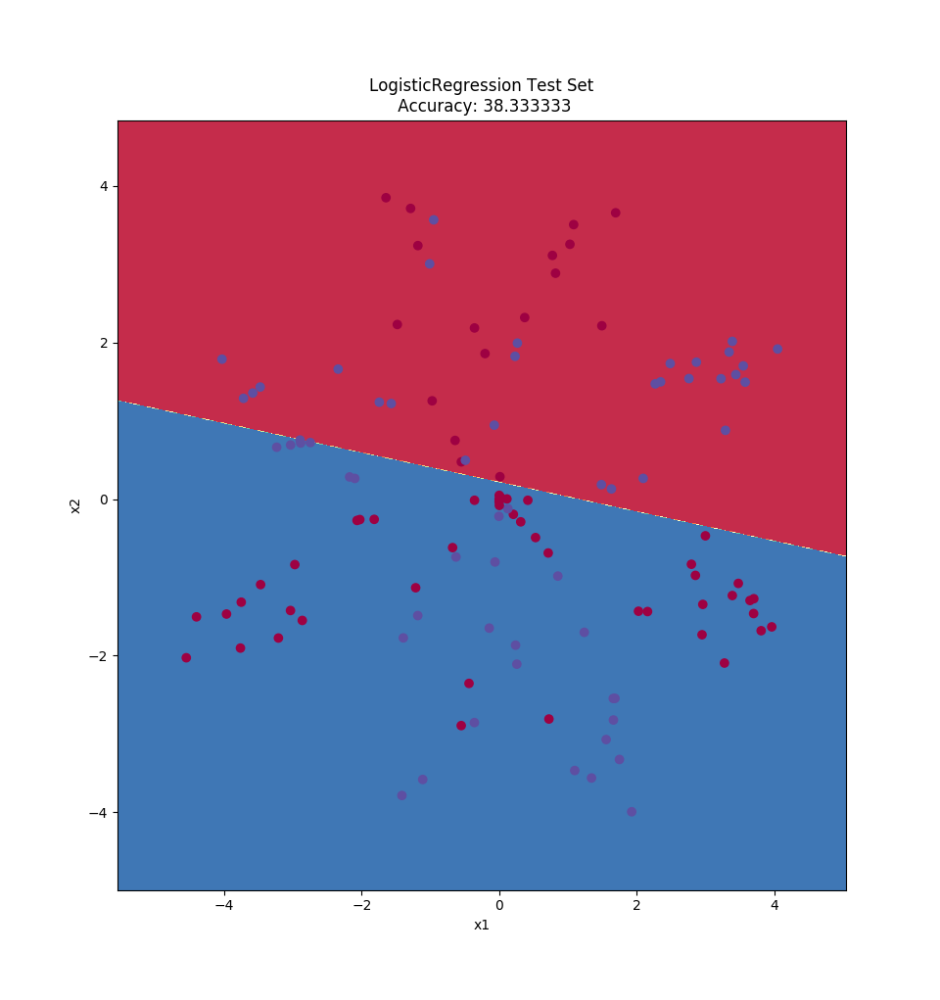

- Single Hidden Layer with 1 neuron

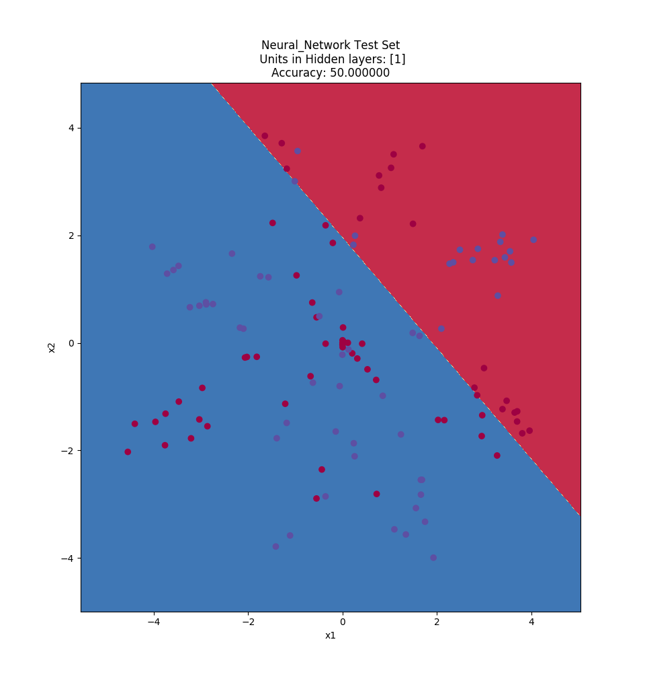

- Single Hidden Layer with 2 neurons

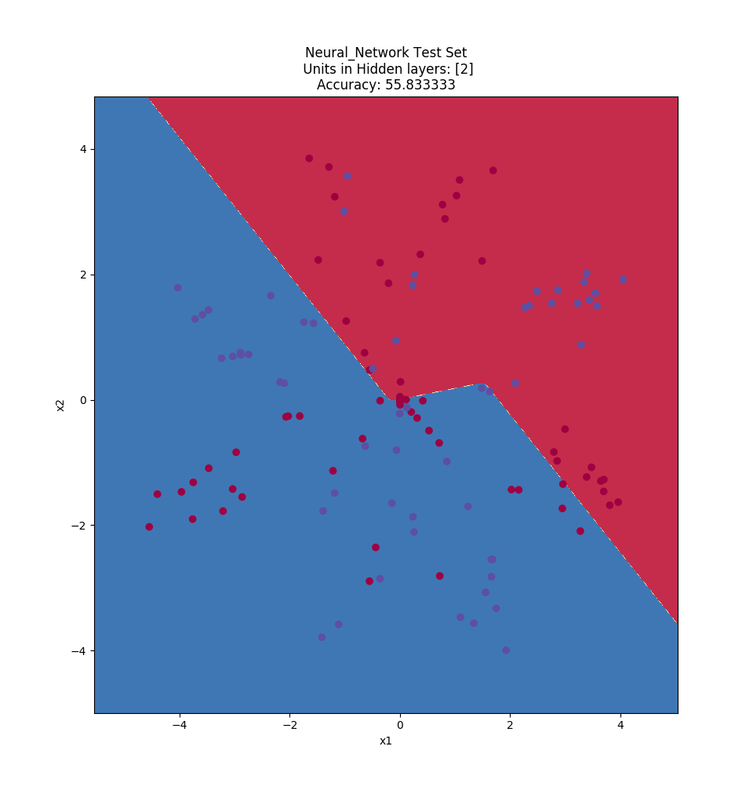

- Single Hidden Layer with 3 neurons

- Single Hidden Layer with 5 neurons

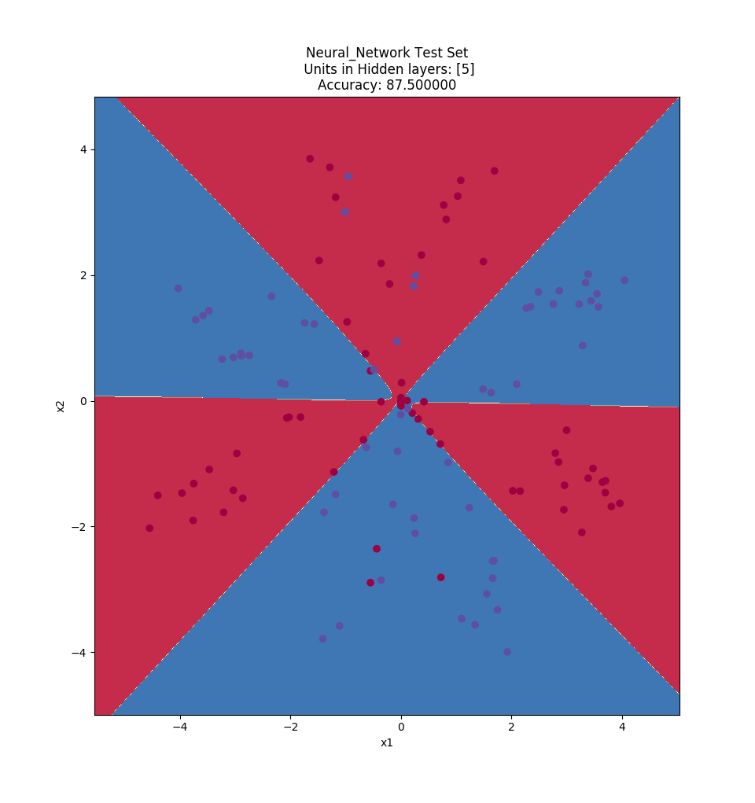

- Single Hidden Layer with 10 neurons

- Single Hidden Layer with 20 neurons

- Single Hidden Layer with 40 neurons

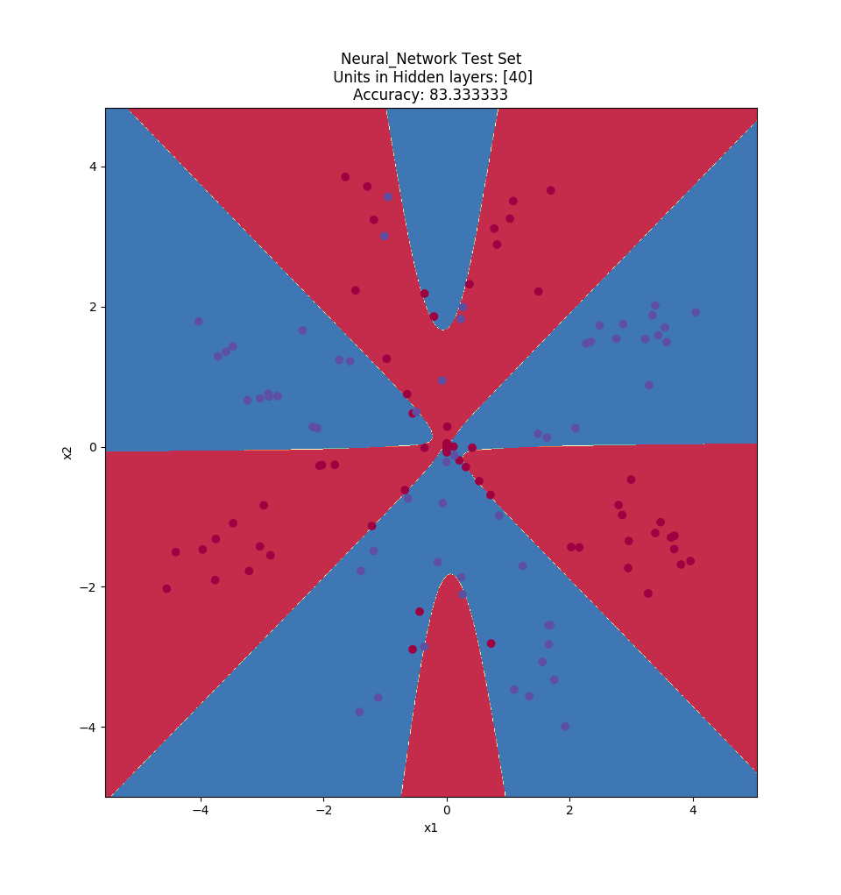

- Two Hidden Layers with 5 neurons each

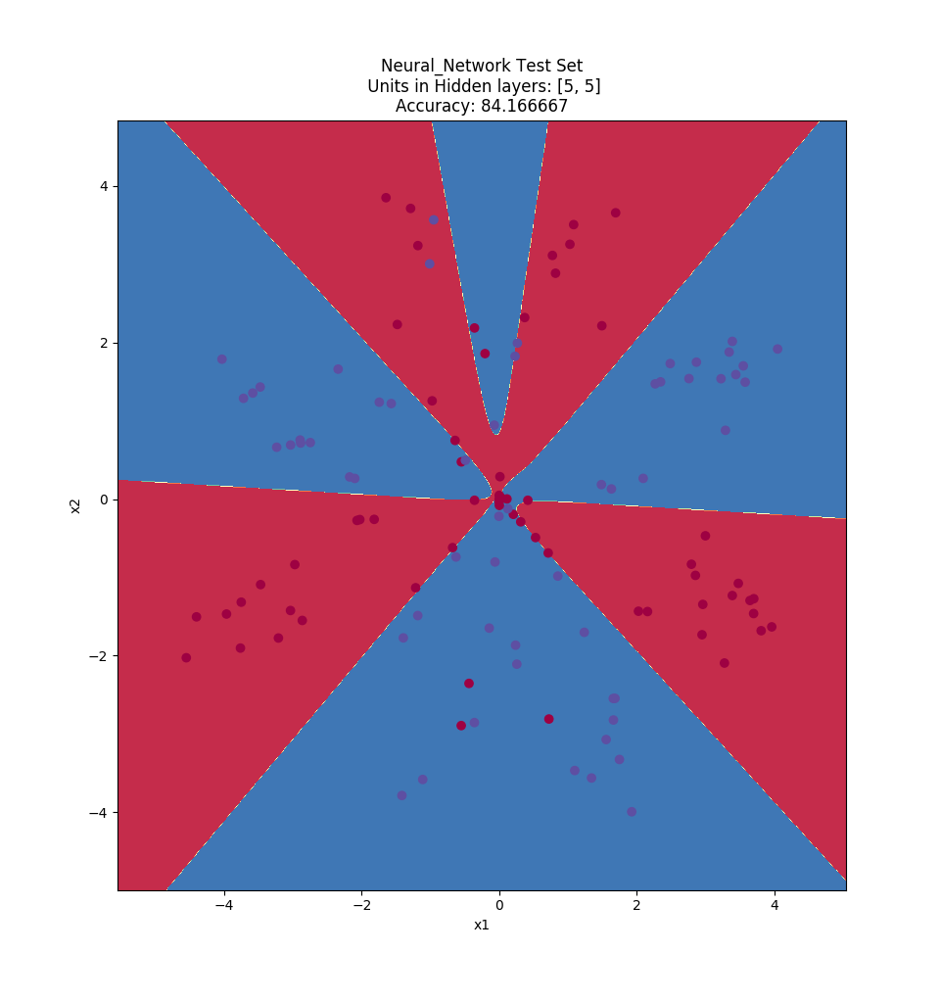

**c. MNIST Handwritten Digits Recognition - 6 & 8**

- SVM Linear: 98.4722% Test accuracy
- Single Perceptron: 98.91% Test accuracy
- 100 units in hidden Layer: 99.1389% Test accuracy

## Assignment 4

**1. K-Means**

Test Acc: 36.685%

**2. PCA + SVM**

Linear SVM: 69.842% Test Acc

Rbf SVM: 81.795% Test Acc

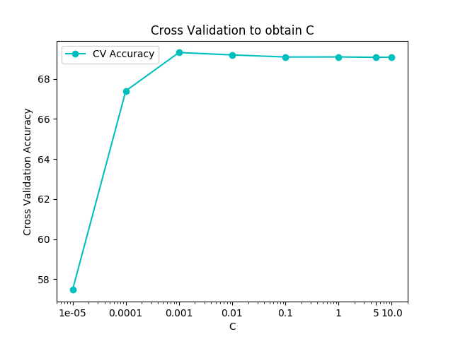

**3. Neural Network**

Single Hidden Layer with 1000 neurons: 77.952%

**4. CNN**

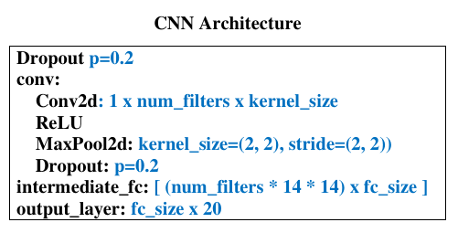

Test Acc: 83.162%

**5. Kaggle Competition**
	[Link to competition](https://www.kaggle.com/c/col-774-spring-2018)

- **Preprocessing**
	
	Normalize data to zero mean and unit vaiance

- **Modified VGG13 Architecture**

	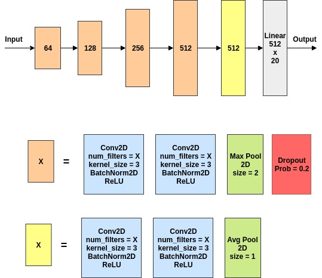

	**Difference from original vgg13**

	1. Dropout Layer after every Max Pool Layer
	2. No Max Pool Layer in Last Conv2D block

- **Hyperparameters**

	- number_of_epochs: 10
	- batch_size: 64
	- Adam optimizer

